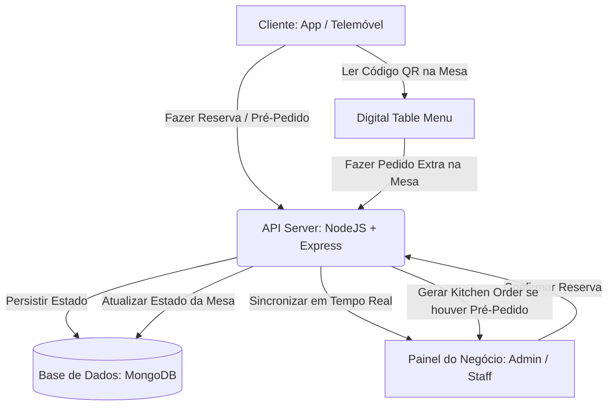

# 🍽️ Azores4you - Arquitetura do Sistema de Restaurantes & Reservas

Este documento serve como referência técnica detalhada sobre o subsistema de **Gestão de Restaurantes, Reservas de Mesas e Pedidos Integrados** na plataforma **Azores4you**.

---

## 🗺️ 1. Visão Geral da Arquitetura

O ecossistema de restaurantes foi projetado para oferecer uma experiência digital contínua, unindo a conveniência do utilizador final (residente ou turista nos Açores) à eficiência operacional dos proprietários de restaurantes (através do Painel de Negócios).



---

## 💾 2. Modelos de Dados e Estrutura (db.json / MongoDB)

### 2.1. O Objeto `Restaurant` (Business)
Cada restaurante é uma extensão de um negócio (`Business`) com propriedades específicas para a ementa, mesas e ordens:

```json
{
  "id": "rest_pdl_o_assador",
  "name": "O Assador Micaelense",
  "businessType": "restaurant",
  "island": "São Miguel",
  "cuisine": "Regional Açoriana",
  "rating": 4.8,
  "reviews": 124,
  "image": "/imagens/restaurantes/assador.jpg",
  "description": "O melhor da carne dos Açores grelhada na brasa...",
  "phone": "+351 296 123 456",
  "publicEmail": "contacto@oassador.pt",
  "tables": [
    {
      "id": "T1",
      "number": 1,
      "seats": 4,
      "status": "available", // "available" | "reserved" | "occupied"
      "customerName": null,
      "reservationTime": null,
      "currentTab": []
    }
  ],
  "dishes": [
    {
      "name": "Bife à Associação",
      "price": 18.50,
      "description": "O tradicional bife regional com alho e pimenta da terra.",
      "image": "/imagens/restaurantes/bife.jpg",
      "credits": 20
    }
  ],
  "reservations": [],
  "kitchenOrders": []
}
```

### 2.2. O Objeto `Reservation`
Cada reserva regista o estado de alocação da mesa, o contacto e se existe um **pré-pedido (pre-order)** de comida:

```json
{
  "id": "RES_1715694830122",
  "businessId": "rest_pdl_o_assador",
  "businessType": "restaurant",
  "customerName": "João Silva",
  "customerEmail": "joao.silva@email.com",
  "customerPhone": "912345678",
  "date": "2026-05-20",
  "time": "20:00",
  "guests": 2,
  "notes": "Mesa perto da janela, por favor.",
  "paymentType": "mbway", // "reserve" (no local) | "mbway" | "points" | "transfer"
  "preOrder": [
    {
      "dish": {
        "name": "Bife à Associação",
        "price": 18.50
      },
      "quantity": 2,
      "meatPoint": "Médio-Mal"
    }
  ],
  "prepRequested": true,
  "requestedTime": "at_reservation", // Preparar para a hora da reserva
  "status": "pending" // "pending" | "accepted" | "occupied" | "finished" | "cancelled"
}
```

---

## 📡 3. Fluxo de Estado e Sincronização Automática (API Server)

O ficheiro central `server.js` contém regras inteligentes que reagem em cascata às alterações de estado das reservas:

### 3.1. Criação de Reserva (`POST /api/reservations`)
* Cria a reserva com estado padrão `"pending"`.
* Associa automaticamente a reserva ao histórico do utilizador correspondente através do e-mail.

### 3.2. Atualização de Reserva (`PUT /api/reservations/:id`)
Quando o restaurante atualiza o estado de uma reserva no seu painel de controlo, a API executa ações lógicas no negócio e nas mesas em tempo real:

| Transição de Estado da Reserva | Ação no Negócio (Restaurante) | Ação nas Mesas |
| :--- | :--- | :--- |
| **`pending` ➔ `accepted`** *(Com mesa e pré-pedido)* | 1. Cria uma **Ordem na Cozinha (Kitchen Order)** automática.<br>2. Adiciona os itens ao painel da cozinha. | Marca a mesa como **`reserved`** e atribui o nome do cliente e hora da reserva. |
| **`accepted` ➔ `occupied`** | Transita os clientes para a mesa correspondente física. | Altera o estado da mesa para **`occupied`**. |
| **`occupied` ➔ `finished`** | Gera a fatura final no POS e liberta o espaço. | Altera a mesa para **`available`** e limpa a conta ativa (`currentTab`). |
| **Qualquer ➔ `cancelled`** | Liberta a reserva de imediato. | Altera a mesa para **`available`** se estivesse retida. |

```javascript
// Exemplo de lógica integrada na API (server.js)
if (updatedRes.status === 'accepted' && updatedRes.tableId && biz.tables) {
    const tableIdx = biz.tables.findIndex(t => t.id === updatedRes.tableId);
    if (tableIdx !== -1) {
        biz.tables[tableIdx] = {
            ...biz.tables[tableIdx],
            status: 'reserved',
            customerName: updatedRes.customerName,
            reservationTime: updatedRes.time
        };
    }
}
```

---

## 📱 4. Componentes e Interfaces Frontend

O sistema de restaurantes apoia-se em três componentes React principais:

### 4.1. `RestaurantModal.tsx` (Interface do Cliente)
* **Slider Dinâmico:** Exibe fotos do ambiente e dos pratos principais com carregamento dinâmico otimizado do servidor Render/Netlify.
* **Leitor de Áudio Integrado (TTS):** Permite escutar a descrição do restaurante numa voz natural (ideal para acessibilidade).
* **Calendário & Horários Interativos:** Seleção fluida de datas futuras e slots de horários com base no dia selecionado.
* **Pré-Pedido de Refeições:** O utilizador pode escolher pratos diretamente da ementa, selecionar pontos de cozedura da carne e garantir a preparação logo no início ou chegada.
* **Pagamentos & Garantias Dinâmicas:** Suporte robusto para pagamento MBWay, Cartão de Crédito, Dinheiro ou **Créditos Acumulados** (Fidelização).

### 4.2. `TableMenuModal.tsx` (Menu Digital Presencial)
* **Menu de Mesa por Código QR:** Destinado aos utilizadores que já se encontram no restaurante sentados.
* **Pedidos Extra:** Permite navegar por categorias de pratos, bebidas, vinhos e sobremesas, adicionando os extras diretamente à conta ativa da mesa (`currentTab`).
* **Segurança Integrada:** Os botões de pedido são desativados se a mesa não estiver marcada como `"occupied"` no sistema.

### 4.3. `BusinessDashboard.tsx` (Painel do Restaurante)
* **Mapa de Mesas Visual:** Visão de olho de pássaro do salão de jantar, com cores em tempo real indicando a disponibilidade (Verde = Livre, Amarelo = Reservada, Vermelho = Ocupada).
* **Gestão de Pedidos POS & Cozinha:** Acompanhamento instantâneo de pedidos ativos que vão para a cozinha, com botões para dar início à confeção ou concluir entrega.
* **Controlo de Faturação e POS:** Permite fechar a conta das mesas, gerar recibos e descontar pontos dos perfis dos utilizadores.
* **Lista de Turnos e Ponto:** Controlo de staff ativo com registo de ponto, férias e escalas.

---

## 🧪 5. Guia Rápido de Testes Locais

Para simular o ecossistema completo localmente:

1. **Inicie o Servidor Backend:**
   ```powershell
   npm run dev
   # ou execute a partir de "server.js" com 'node server.js'
   ```
2. **Execute o script de diagnóstico** para verificar o estado inicial das reservas:
   ```powershell
   node scratch/check_db.js
   ```
3. **Limpe a base de dados de testes** a qualquer momento enviando um POST rápido:
   ```bash
   POST http://localhost:3001/api/clear-reservations
   ```
   *(Este comando útil limpa todas as reservas pendentes, pedidos ativos e liberta todas as mesas de volta a `available` instantaneamente para novos testes de fluxos).*

---

> [!NOTE]
> **Compatibilidade de Produção (Açores4you):**
> O sistema deteta automaticamente o ambiente de rede (localhost vs RENDER API) para garantir conectividade perfeita sem intervenção manual nas configurações.
